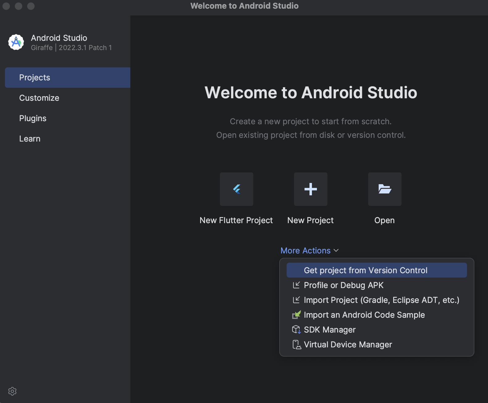
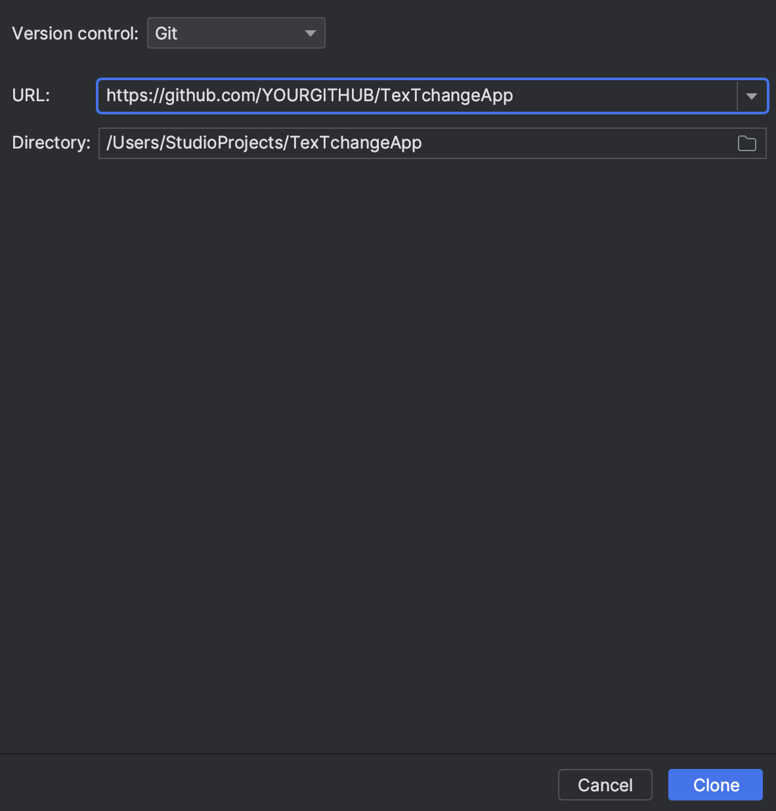
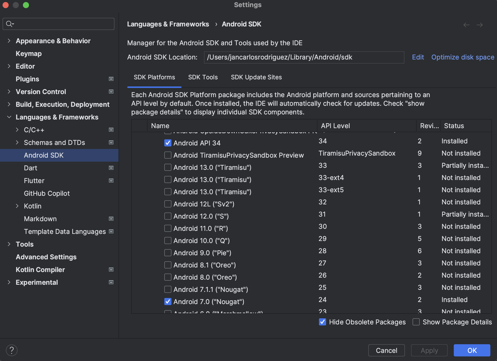
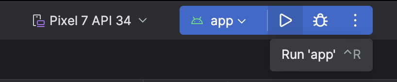

# TxTchange App

TxTchange is an Android app built using Jetpack Compose. It allows Hofstra Students to exchange textbooks with other users.

# Software Requirements Document

[Software Requirements Document](https://github.com/Jrod7938/TexTchangeApp/wiki)

# Developers
- [Jrod7938](https://github.com/Jrod7938)
- [Khang-ALe](https://github.com/Khang-ALe)
- [jesma14](https://github.com/jesma14)
- [Holesum](https://github.com/Holesum)

## How to Run

Follow these steps to run the TexTchange app on your local machine:

### 1. Clone the GitHub Project
Open Android Studio and click "Get Project from Version Control" as seen in the image below.

### 2. Update the GitHub URL
Update the GitHub URL to match your forked version of this repository as seen in the image below.

### 3. Download SDKs
Open Android Studio settings and click Android SDK. Download the SDKs as shown in the image below. Click "edit" in the Android SDK Location.

### 4. Add SDK to the Project
Add the SDK to the project as seen in the image below. Click Next.

### 5. Confirm SDK
Click Finish as seen in the image below.

### 6. Create a Virtual Device
In Android Studio, open your device manager. Create a device if one is not present as seen in the image below.

### 7. Run the Application
Run the Android application by clicking 'run app' as seen in the image below.

## Contributing

To contribute:

1. Fork this repository.
2. Create a new branch.
3. Make your changes and submit a pull request.

